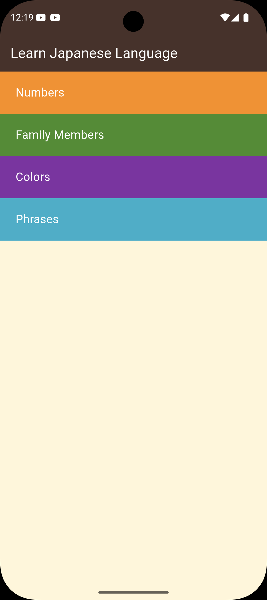
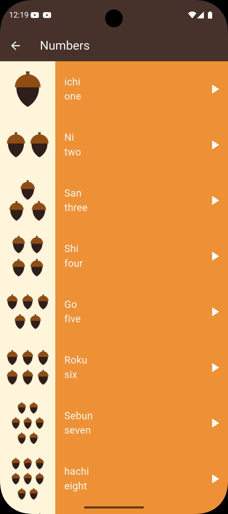
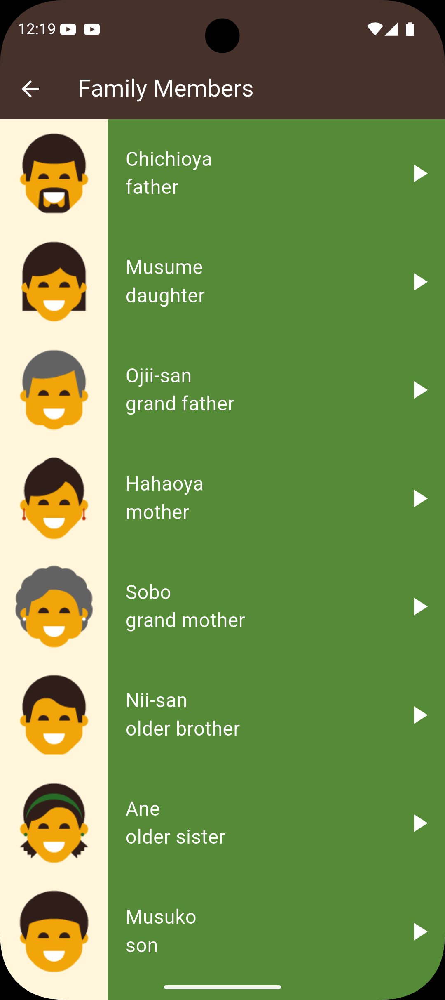
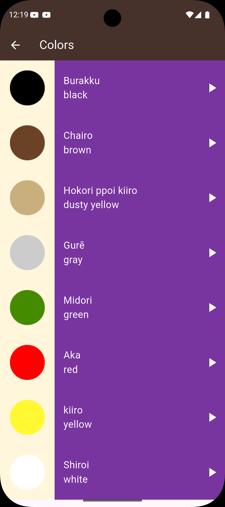
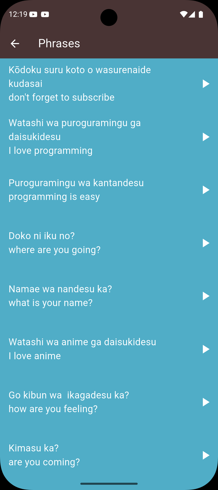

# 🇯🇵 Learn Japanese Language App

A modern and interactive **Japanese Language Learning Application built with Flutter** that helps users learn basic Japanese vocabulary through visual content and audio pronunciation.

The application focuses on essential beginner topics such as **numbers, colours, family members, and common phrases**, making it ideal for learners who want to start understanding Japanese in a simple and engaging way.

---

## ✨ Features

- **Numbers Learning (数字)** – Learn Japanese numbers from 1 to 10  
- **Colours (色)** – Discover colour names with visual examples  
- **Family Members (家族)** – Understand family relationship vocabulary  
- **Common Phrases (フレーズ)** – Learn useful daily expressions  
- **Audio Pronunciation** – Tap items to hear correct pronunciation  
- **Visual Learning** – Images help reinforce vocabulary  
- **Simple UI** – Clean and beginner-friendly interface  
- **Cross Platform** – Runs on Android, iOS, Web, Windows, Linux, and macOS

---

## 🛠️ Tech Stack

- **Framework:** Flutter SDK ^3.5.4  
- **Language:** Dart  
- **Audio Playback:** audioplayers ^5.2.1  
- **Icons:** cupertino_icons ^1.0.8  
- **Architecture:** Modular project structure with reusable components  

---

## 📁 Project Structure

```
lib/
├── main.dart                 # App entry point
├── components/               # Reusable UI components
├── helpers/                  # Helper functions and utilities
├── models/                   # Data models
│   ├── category_model.dart   # Category data structure
│   ├── item_model.dart       # Item data structure
│   └── phrase_model.dart     # Phrase data structure
│
└── screens/                  # Application screens
    ├── home_page.dart
    ├── numbers_page.dart
    ├── colors_page.dart
    ├── family_members_page.dart
    └── phrases_page.dart
```

```
assets/
├── images/
│   ├── numbers/
│   ├── colors/
│   └── family_members/
│
└── sounds/
    ├── numbers/
    ├── colors/
    ├── family_members/
    └── phrases/
```

---

## 🚀 Getting Started

### Prerequisites

Before running the project make sure you have installed:

- Flutter SDK **3.5.4 or higher**
- Dart SDK (included with Flutter)
- Android Studio or VS Code with Flutter extension
- Android emulator, iOS simulator, or physical device

---

### Installation

1. Clone the repository

```bash
git clone <repository-url>
```

2. Navigate to the project folder

```bash
cd learn_japanese_language_app
```

3. Install dependencies

```bash
flutter pub get
```

4. Run the application

```bash
flutter run
```

---

## 📚 Learning Content

### 🔢 Numbers (数)

Learn how to count from **1 to 10** in Japanese:

- One (一)  
- Two (二)  
- Three (三)  
- Four (四)  
- Five (五)  
- Six (六)  
- Seven (七)  
- Eight (八)  
- Nine (九)  
- Ten (十)

---

### 🎨 Colours (色)

Learn common colour vocabulary:

- Red  
- Green  
- Blue  
- Yellow  
- Brown  
- Black  
- White  
- Gray  
- Dusty Yellow

---

### 👨‍👩‍👧‍👦 Family Members (家族)

Understand family relationship terms in Japanese:

- Father  
- Mother  
- Older Brother  
- Older Sister  
- Younger Brother  
- Younger Sister  
- Grandfather  
- Grandmother  
- Son  
- Daughter

---

### 💬 Common Phrases (フレーズ)

Essential Japanese phrases used in daily conversation to help beginners communicate more confidently.

---

## 🎨 UI Components

The application is built using reusable widgets including:

- **Category Card** – Displays learning categories on the home screen  
- **Item Widget** – Shows vocabulary with image and pronunciation  
- **Audio Player Integration** – Plays native Japanese pronunciation  

---

## 📷 Screenshots


<div align="center">
  
  
  
</div>

<div align="center">
  
  
</div>


---

## 🌍 Supported Platforms

This application can run on:

- Android  
- iOS  
- Web  
- Windows  
- Linux  
- macOS  

---

## 🤝 Contributing

Contributions are welcome!  
Feel free to fork the repository and submit pull requests for improvements.

### Possible Enhancements

- Add more vocabulary categories  
- Implement quizzes and interactive exercises  
- Add user progress tracking  
- Add dark mode  
- Improve animations and UI transitions  
- Add offline support for audio files  

---

## 📜 License

This project is licensed under the **MIT License**.

---


## 📜 License

This project is open source and available for learning and development purposes.

---

## 📞 Contact

If you have any questions, feedback, or suggestions, feel free to get in touch. I’m happy to help!